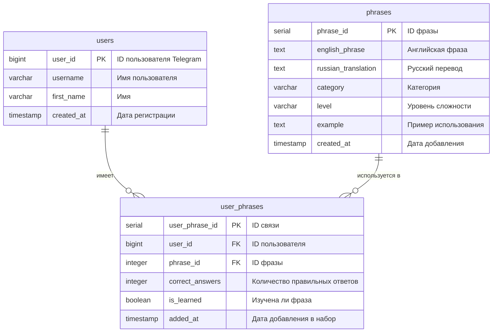

# ER-диаграмма базы данных EnglishCards Bot

## Описание

Эта диаграмма показывает структуру базы данных для бота изучения английских фраз.

## ER-диаграмма (Mermaid)

## Описание таблиц

### users
Таблица пользователей бота.

- **user_id** (BIGINT, PRIMARY KEY) - Уникальный идентификатор пользователя из Telegram
- **username** (VARCHAR(100)) - Имя пользователя в Telegram
- **first_name** (VARCHAR(100)) - Имя пользователя
- **created_at** (TIMESTAMP) - Дата и время регистрации пользователя

### phrases
Таблица всех фраз в системе.

- **phrase_id** (SERIAL, PRIMARY KEY) - Автоинкрементный идентификатор фразы
- **english_phrase** (TEXT, NOT NULL) - Английская фраза
- **russian_translation** (TEXT, NOT NULL) - Русский перевод
- **category** (VARCHAR(100)) - Категория фразы (например, "greetings", "communication", "custom")
- **level** (VARCHAR(10)) - Уровень сложности (A2, B1, B2 и т.д.)
- **example** (TEXT) - Пример использования фразы
- **created_at** (TIMESTAMP) - Дата и время добавления фразы
- **UNIQUE(english_phrase, russian_translation)** - Уникальность комбинации фразы и перевода

### user_phrases
Таблица связи пользователей и фраз (прогресс изучения).

- **user_phrase_id** (SERIAL, PRIMARY KEY) - Автоинкрементный идентификатор связи
- **user_id** (BIGINT, FOREIGN KEY) - Ссылка на пользователя (users.user_id)
- **phrase_id** (INTEGER, FOREIGN KEY) - Ссылка на фразу (phrases.phrase_id)
- **correct_answers** (INTEGER, DEFAULT 0) - Количество правильных ответов
- **is_learned** (BOOLEAN, DEFAULT FALSE) - Флаг изученности фразы (true после 3 правильных ответов)
- **added_at** (TIMESTAMP) - Дата и время добавления фразы в набор пользователя
- **UNIQUE(user_id, phrase_id)** - Уникальность связи пользователь-фраза

## Связи

1. **users → user_phrases**: Один пользователь может иметь множество фраз в своем наборе (1:N)
2. **phrases → user_phrases**: Одна фраза может быть добавлена многими пользователями (1:N)
3. **CASCADE DELETE**: При удалении пользователя или фразы автоматически удаляются связанные записи в user_phrases

## Логика работы

- Пользователь может добавлять фразы в свой набор
- Система отслеживает прогресс изучения каждой фразы
- Фраза считается изученной после 3 правильных ответов подряд
- При неправильном ответе счетчик правильных ответов уменьшается (но не ниже 0)
